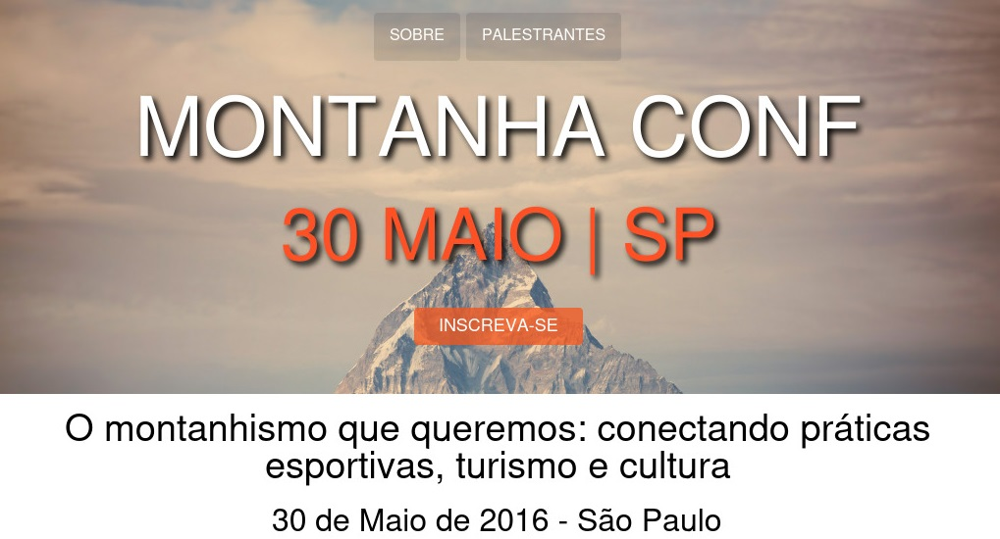

# Projeto Front-end

### Projeto desenvolvido para o curso *Front-end: Projeto de conclusão* com o instrutor Flávio Almeida (Alura).

### 📚  Descrição

Uma página de conferência, que exibe informações do evento, palestrantes, formulário de contato entre outras informações e apresenta layout responsivo.
Para realização do projeto foi utilizada a bagagem dos cursos de HTML, CSS e Javascript da formação de Front-end.

### 🖥️  Recursos Utilizados

- [Visual Studio Code](https://code.visualstudio.com/download)
- [jQuery](https://jquery.com/)

&nbsp;

##### Clique na imagem para visualizar a página:

&nbsp;

